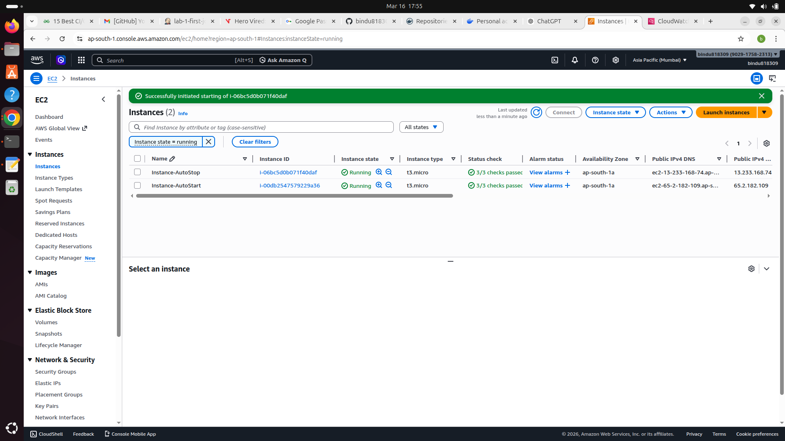
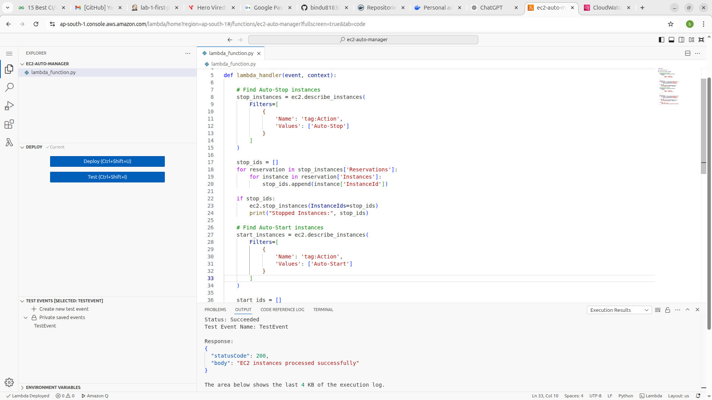
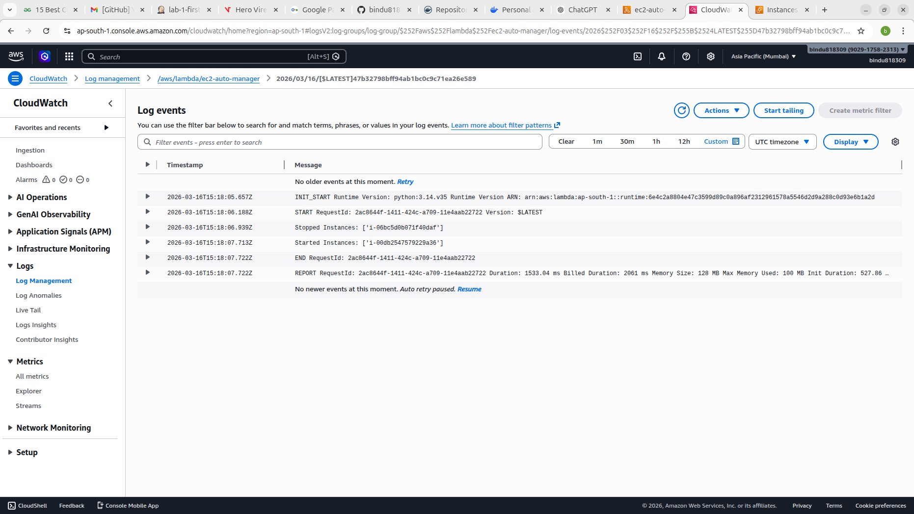

# Assignment 1: Automated Instance Management Using AWS Lambda and Boto3

## Objective
The objective of this assignment is to gain hands-on experience with **AWS Lambda** and **Boto3** by automating the start and stop operations of **EC2 instances** based on instance tags.

Technologies used:
- Amazon EC2
- AWS Lambda
- IAM (Identity and Access Management)
- Boto3 (Python SDK for AWS)

---

# Architecture Overview

Event Trigger → AWS Lambda → Boto3 → EC2 Instance Management

Lambda checks EC2 tags and performs the following:

- Instances tagged **Auto-Stop** → Stop instance
- Instances tagged **Auto-Start** → Start instance

---

# Step 1: EC2 Instance Setup

1. Login to AWS Management Console
2. Navigate to **EC2 Dashboard**
3. Launch two instances with the following configuration:

Instance Type:

t2.micro


### Instance 1 Tag

| Key | Value |
|----|----|
| Action | Auto-Stop |

### Instance 2 Tag

| Key | Value |
|----|----|
| Action | Auto-Start |

---

# Step 2: Create IAM Role for Lambda

1. Open IAM Dashboard
2. Click **Roles**
3. Select **Create Role**
4. Choose trusted entity:


AWS Service → Lambda


Attach policy:


AmazonEC2FullAccess


Role name:


LambdaEC2ManagementRole


---

# Step 3: Create Lambda Function

1. Navigate to **AWS Lambda**
2. Click **Create Function**

Configuration:

Function Name

ec2-auto-manager


Runtime

Python 3.x


Execution Role

LambdaEC2ManagementRole


---

# Step 4: Lambda Python Code

```python
import boto3

ec2 = boto3.client('ec2')

def lambda_handler(event, context):

    stop_instances = ec2.describe_instances(
        Filters=[{'Name': 'tag:Action','Values': ['Auto-Stop']}]
    )

    stop_ids = []
    for reservation in stop_instances['Reservations']:
        for instance in reservation['Instances']:
            stop_ids.append(instance['InstanceId'])

    if stop_ids:
        ec2.stop_instances(InstanceIds=stop_ids)
        print("Stopped Instances:", stop_ids)

    start_instances = ec2.describe_instances(
        Filters=[{'Name': 'tag:Action','Values': ['Auto-Start']}]
    )

    start_ids = []
    for reservation in start_instances['Reservations']:
        for instance in reservation['Instances']:
            start_ids.append(instance['InstanceId'])

    if start_ids:
        ec2.start_instances(InstanceIds=start_ids)
        print("Started Instances:", start_ids)

    return {
        'statusCode': 200,
        'body': 'EC2 instances processed successfully'
    }
Step 5: Create Test Event

Create a test event in Lambda.

Event Name:

TestEvent

Event JSON:

{}

Click Test to execute the function.

Step 6: Verify Results

Go to EC2 Dashboard and verify:

Tag	Expected Result
Auto-Stop	Instance Stops
Auto-Start	Instance Starts
Step 7: Logs Monitoring

Logs can be viewed in CloudWatch Logs.

Example log output:

Stopped Instances: ['i-123456']
Started Instances: ['i-789012']

# Screenshots

## EC2 Instances Created


## Lambda Function Created


## Lambda Test Event


## EC2 Instance State Change


## CloudWatch Logs

Result

The AWS Lambda function successfully automated EC2 instance management by detecting instance tags and performing start or stop operations accordingly.

Conclusion

This assignment demonstrated how serverless computing using AWS Lambda combined with Boto3 can automate infrastructure management tasks efficiently. Tag-based automation allows better control and reduces manual intervention in cloud environments.
