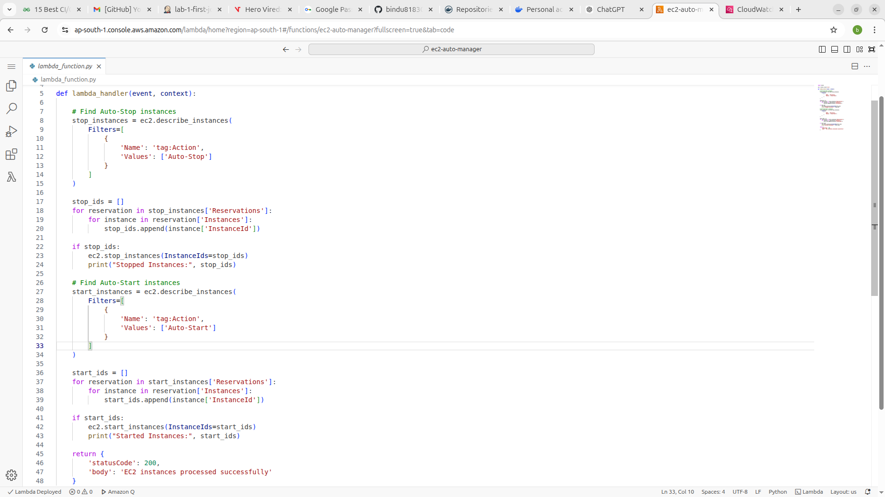
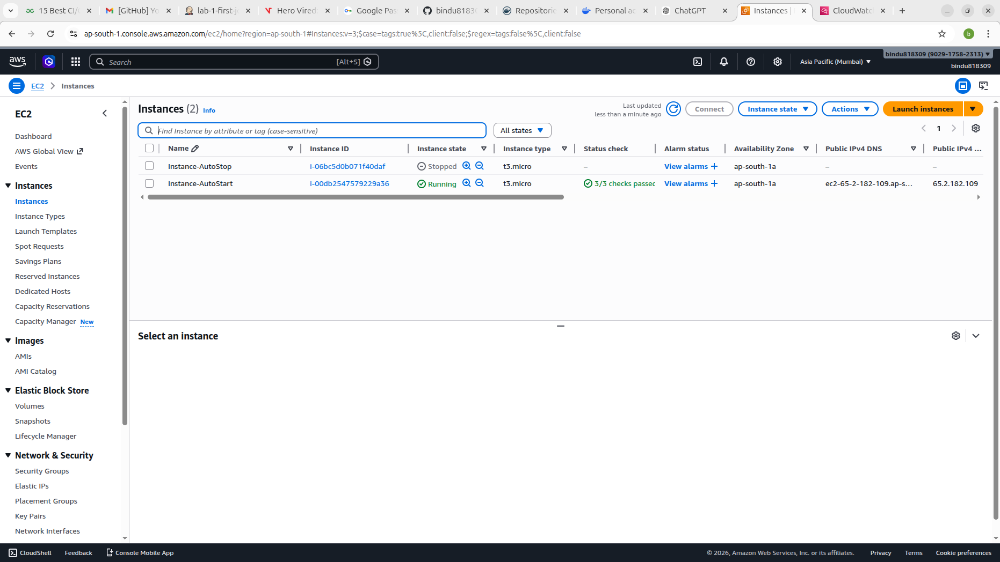

🚀 Serverless Architecture Using AWS Lambda and Boto3

This repository contains multiple assignments demonstrating serverless automation using AWS services.

📌 Assignment 1: Automated Instance Management Using AWS Lambda and Boto3
Objective

The objective of this assignment is to gain hands-on experience with AWS Lambda and Boto3 by automating the start and stop operations of EC2 instances based on instance tags.

Technologies used:
Amazon EC2
AWS Lambda
IAM (Identity and Access Management)
Boto3 (Python SDK for AWS)
Architecture Overview

Event Trigger → AWS Lambda → Boto3 → EC2 Instance Management

Lambda checks EC2 tags and performs the following:

Instances tagged Auto-Stop → Stop instance
Instances tagged Auto-Start → Start instance

Step 1: EC2 Instance Setup

Login to AWS Management Console
Navigate to EC2 Dashboard

Launch two instances with the following configuration:

Instance Type: t2.micro

Instance 1 Tag
Key	Value
Action	Auto-Stop
Instance 2 Tag
Key	Value
Action	Auto-Start
Step 2: Create IAM Role for Lambda

Open IAM Dashboard
Click Roles → Create Role
Choose trusted entity: AWS Service → Lambda
Attach policy: AmazonEC2FullAccess
Role name: LambdaEC2ManagementRole

Step 3: Create Lambda Function
Property	Value
Function Name	ec2-auto-manager
Runtime	Python 3.x
Execution Role	LambdaEC2ManagementRole
Step 4: Lambda Python Code
import boto3

ec2 = boto3.client('ec2')

def lambda_handler(event, context):

    # Find Auto-Stop instances
    stop_instances = ec2.describe_instances(
        Filters=[
            {
                'Name': 'tag:Action',
                'Values': ['Auto-Stop']
            }
        ]
    )

    stop_ids = []
    for reservation in stop_instances['Reservations']:
        for instance in reservation['Instances']:
            stop_ids.append(instance['InstanceId'])

    if stop_ids:
        ec2.stop_instances(InstanceIds=stop_ids)
        print("Stopped Instances:", stop_ids)

    # Find Auto-Start instances
    start_instances = ec2.describe_instances(
        Filters=[
            {
                'Name': 'tag:Action',
                'Values': ['Auto-Start']
            }
        ]
    )

    start_ids = []
    for reservation in start_instances['Reservations']:
        for instance in reservation['Instances']:
            start_ids.append(instance['InstanceId'])

    if start_ids:
        ec2.start_instances(InstanceIds=start_ids)
        print("Started Instances:", start_ids)

    return {
        'statusCode': 200,
        'body': 'EC2 instances processed successfully'
    }
Step 5: Create Test Event

Event Name: TestEvent

Event JSON:

{}

Click Test to execute the function

Step 6: Verify Results
Tag	Expected Result
Auto-Stop	Instance Stops
Auto-Start	Instance Starts
Step 7: Logs Monitoring

Logs can be viewed in CloudWatch Logs.

Example log output:

Stopped Instances: ['i-123456']
Started Instances: ['i-789012']

### Setup

### Lambda Function

### Output

📌 Assignment 2: Automated S3 Bucket Cleanup Using AWS Lambda and Boto3
📌 Objective

The objective of this assignment is to automate the deletion of files older than 30 days in an Amazon S3 bucket using AWS Lambda and Boto3.

🪣 S3 Bucket Setup

An S3 bucket named my-cleanup-bucket-hero was created.

Multiple files were uploaded into the bucket, including:

Python files (.py)
Text files (.txt)

Some files were used to simulate older data for testing the cleanup process.

🔐 IAM Role Configuration

An IAM role was created for the Lambda function:

Role Type: AWS Service → Lambda

Permissions Policy: AmazonS3FullAccess

This role allows the Lambda function to:

List objects in the S3 bucket
Delete objects from the bucket

⚙️ Lambda Function Implementation

A Lambda function was created using Python 3.x runtime.

🔧 Function Code
import boto3
from datetime import datetime, timezone, timedelta

s3 = boto3.client('s3')

BUCKET_NAME = 'my-cleanup-bucket-hero'
DAYS_OLD = 2  # Adjusted for testing

import boto3
from datetime import datetime, timezone, timedelta

s3 = boto3.client('s3')

BUCKET_NAME = 'my-cleanup-bucket-hero'
DAYS_OLD = 2   # changed for testing

def lambda_handler(event, context):
    cutoff_date = datetime.now(timezone.utc) - timedelta(days=DAYS_OLD)

    response = s3.list_objects_v2(Bucket=BUCKET_NAME)

    if 'Contents' not in response:
        print("No objects found.")
        return

    deleted_files = []

    for obj in response['Contents']:
        file_name = obj['Key']
        last_modified = obj['LastModified']
        print(f"File: {file_name}, Last Modified: {last_modified}")

        if last_modified < cutoff_date:
            s3.delete_object(Bucket=BUCKET_NAME, Key=file_name)
            deleted_files.append(file_name)
            print(f"Deleted: {file_name}")

    if not deleted_files:
        print("No files deleted.")
    else:
        print(f"Deleted {len(deleted_files)} files.")

    return {
        'statusCode': 200,
        'body': f"Deleted {len(deleted_files)} files"
    }
Result

The AWS Lambda function successfully deleted files older than the defined threshold while keeping recent files intact.

📌 Assignment 3: DynamoDB Item Change Alert Using AWS Lambda, Boto3, and SNS
Objective

Automate the process to receive an alert whenever an item in a DynamoDB table gets updated.

Architecture

DynamoDB → Streams → Lambda → SNS → Email Alert

Sample Item
{
  "id": "2",
  "name": "Item2",
  "status": "inactive"
}
Lambda Code
import json
import boto3

sns = boto3.client('sns')

SNS_TOPIC_ARN = 'arn:aws:sns:ap-south-1:902917582313:DynamoDBAlerts'

def lambda_handler(event, context):
    print("Received event:", json.dumps(event))

    for record in event['Records']:
        if record['eventName'] == 'MODIFY':
            
            old_image = record['dynamodb'].get('OldImage', {})
            new_image = record['dynamodb'].get('NewImage', {})

            message = "DynamoDB Item Updated!\n\n"
            message += "Old Value:\n"
            message += json.dumps(old_image, indent=2)
            message += "\n\nNew Value:\n"
            message += json.dumps(new_image, indent=2)

            response = sns.publish(
                TopicArn=SNS_TOPIC_ARN,
                Message=message,
                Subject="DynamoDB Item Update Alert"
            )

            print("SNS Notification sent! Message ID:", response['MessageId'])

    return {
        'statusCode': 200,
        'body': json.dumps('Processed DynamoDB update event')
    }
Result

Notification is sent whenever a DynamoDB item is updated.

📌 Assignment 4: Auto-Tagging EC2 Instances on Launch Using AWS Lambda and Boto3
Objective

Learn to automate the tagging of EC2 instances as soon as they are launched, ensuring better resource tracking and management.

Architecture Overview

When an EC2 instance is launched:

EventBridge (CloudWatch Events) detects the launch
It triggers AWS Lambda
Lambda uses Boto3 to tag the instance automatically
Lambda Function Code (Boto3)
import boto3
from datetime import datetime
 import boto3
import datetime

ec2 = boto3.client('ec2')

def lambda_handler(event, context):
    try:
        # Extract instance ID from event
        instance_id = event['detail']['instance-id']
        
        # Get current date
        current_date = datetime.datetime.utcnow().strftime('%Y-%m-%d')
        
        # Create tags
        tags = [
            {
                'Key': 'LaunchDate',
                'Value': current_date
            },
            {
                'Key': 'Owner',
                'Value': 'AutoTagged'
            }
        ]
        
        # Apply tags to the instance
        ec2.create_tags(
            Resources=[instance_id],
            Tags=tags
        )
        
        print(f"Successfully tagged instance {instance_id} with {tags}")
        
    except Exception as e:
        print(f"Error tagging instance: {str(e)}")
        raise
Result

The Lambda function successfully tagged EC2 instances automatically upon launch using EventBridge trigger and Boto3.
